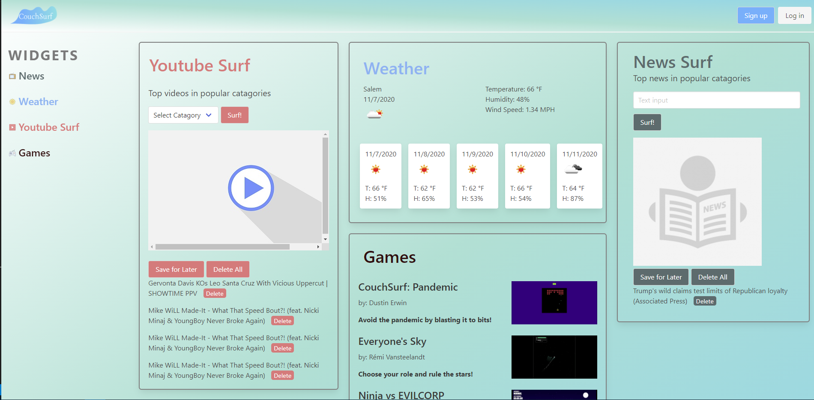

# CouchSurf

A dashboard App to guide your internet desires

[CouchSurf Link ](https://dustinerwin.github.io/CouchSurf/)

## Goal

To create a Weather App with the following criteria:

- Use a CSS Framework other than Bootstrap
- Be deployed to GitHub Pages.
- Be interactive (i.e., accept and respond to user input).
- Use at least two server-side APIs.
- Does not use alerts, confirms, or prompts (use modals).
- Use client-side storage to store persistent data.
- Be responsive.
- Have a polished UI.
- Have a clean repository that meets quality coding standards (file structure, naming conventions, follows best practices for class/id naming  
  conventions, indentation, quality comments, etc.).
- Have a quality README (with unique name, description, technologies used, screenshot, and link to deployed application).

## Description:

An app organization platform that allows you to see all your favorite apps on a single page. The project has the following features.

1. A weather section that uses an API to track your location and tell you the weather and forecast.
2. A game section including a 3 third party games and one created game.
3. Youtube section:
   - pulls hottest trending videos from certain categories
   - ability to save current video for later
   - delete all button
   - individual delete button for each saved item
4. News section
   - displays the hottest trending news topic entered in search bar
   - ability to save favorites
   - displays title, description, image, and source link
   - delete all button
   - individual delete button for each saved item
5. SideBar

## Technologies Used:

1. Bulma Framework
2. News Api
3. Youtube Data Api
4. Weather Api

## Successes

- Ethan: I successfully implemented my first two APIs. the individual delete buttons were particularly challenging, but I was
  happy I was able to get them to function properly. With more time, I would love to implement a second ajax call to another
  news Api that allows the user to filter results through a specific news organization. I was working on it but ran out of time.

- Seth: I successfully incorporated the user's current location in order to provide personalized weather conditions.

- Dustin: I successfully manipulated the games code to polish and add extra game functionality. In the future, I would
  Add different enemies with different movements for bonuses.

- Nick: I successfully created a custom look not dependant on bulma.

- Michael: A major success I achieved was making the design look sleek and modern. Referencing other dashboards and using the  
  bulimia framework helped make that possible. With more time I would have made widgets draggable and their dimensions adjustable.

## Challenges

- Ethan: Not refactoring my code as I went led to me taking more time to figure out simple problems. It never mattered for
  tiny projects, but as they increase in complexity I plan to slow down and clean up more as I go for easier understanding.

- Seth: The major challenge was figuring out how to retrieve the current location and then using reverse geolocation to convert the coordinates into the name of the town/city.

- Michael: Figuring out how to add the sidebar was very difficult even though the solution was very simple. I assumed I needed a complex approach to make it happen like using a modal or creating a block from scratch that would stick to the right side of the page, however I decided to add a new column and give sidebar functionality and that worked perfectly.

- Dustin: Finding a game with mechanics that I could comprehend and implement in the time given.

- Nick: Making sure my css did not conflict with the bulma frame work.
